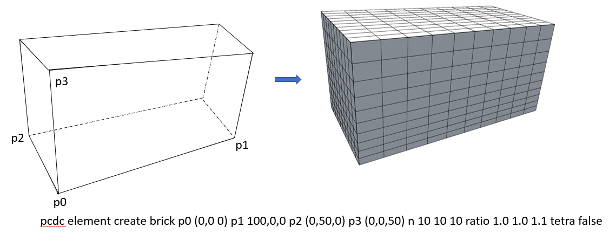

# b{rick}
pcdc e{lement} create <span style='color: red;'>b{rick}</span>
> **描述：**生成一个如图所示的六面体块体模型




**子关键词：**[n](e{lement}/create/b{rick}/n/)，[r{atio}](e{lement}/create/b{rick}/r{atio}/)，


**举例：**
```
pcdc element create brick p0 (0,0 0) p1 100,0,0 p2 (0,50,0) p3 (0,0,50) n 10 10 10 ratio 1.0 1.0 1.1 tetra false
				
#该命令生成上图所示六面体单元模型

```
